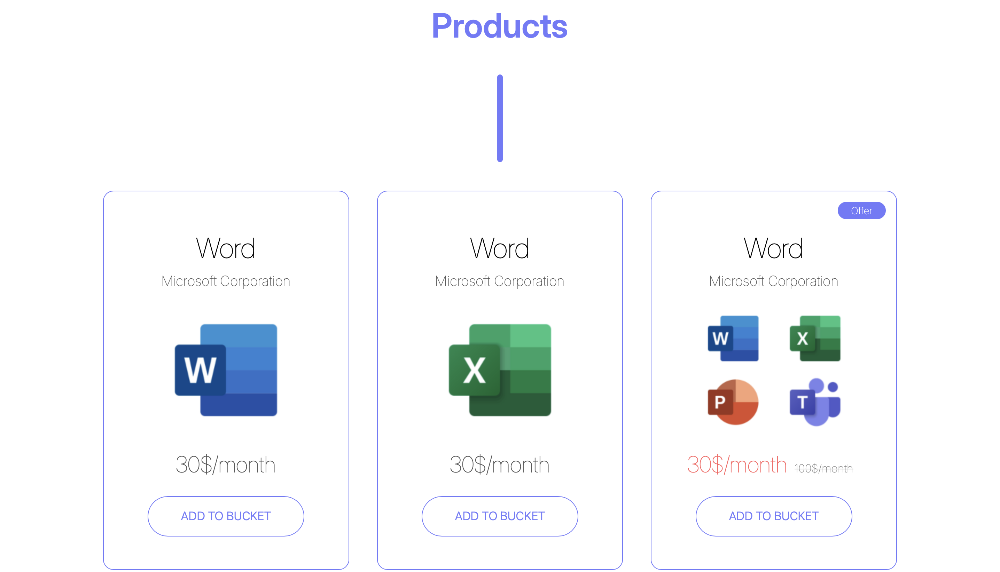
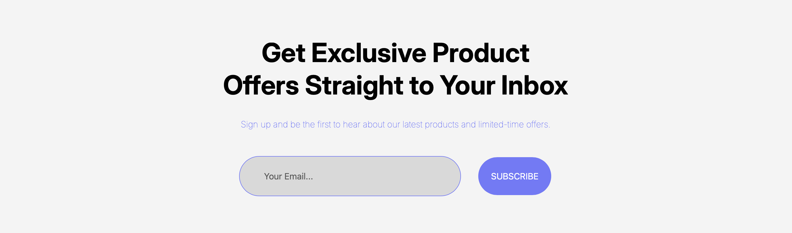
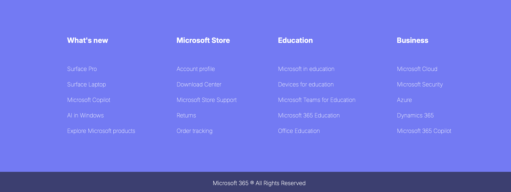
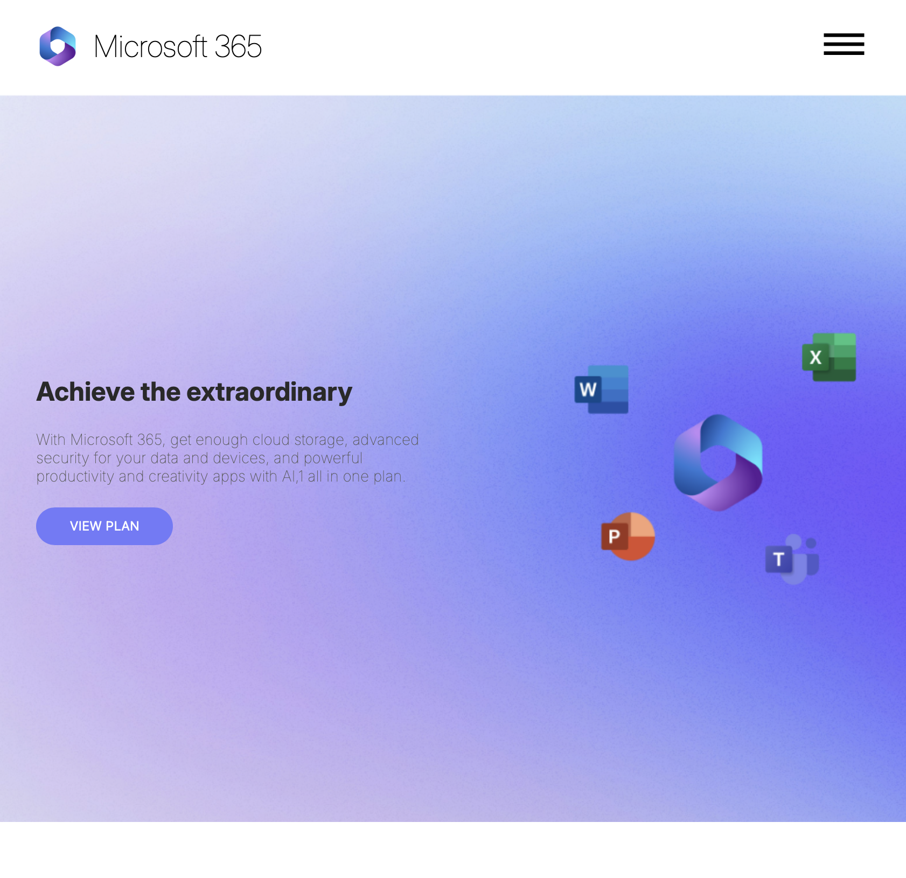
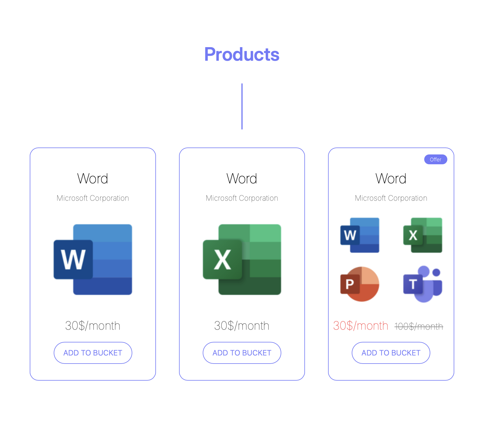
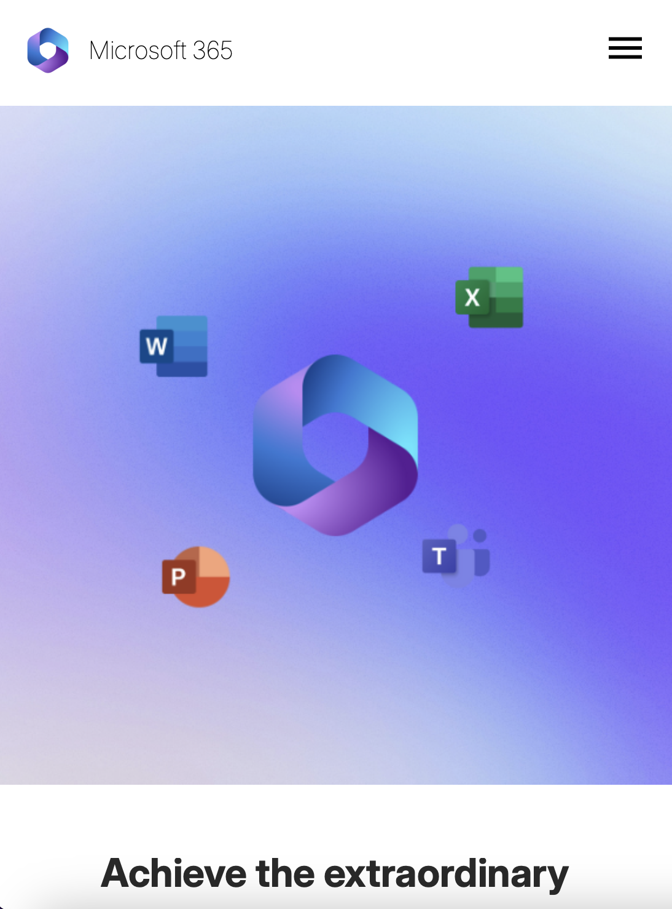
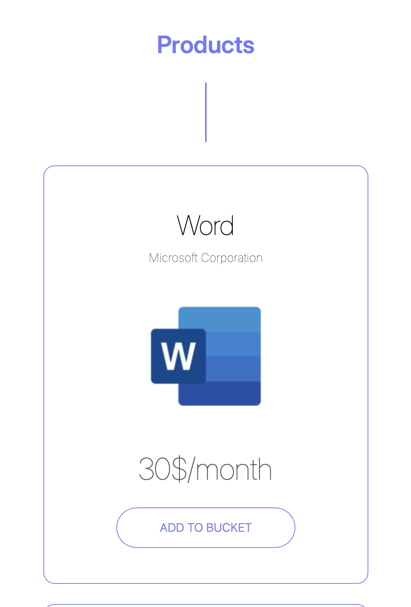
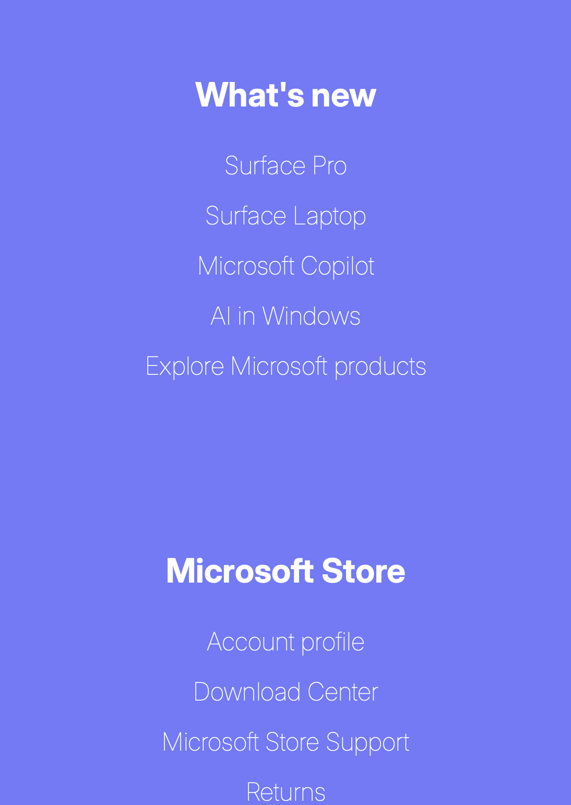

# Web-Design-HTML-CSS

## 🚀 About Web-Design-HTML-CSS

This is a **responsive one-page website** designed and developed based on a **Figma prototype** that was also **designed by me**. The purpose of this project is to translate a high-fidelity UI design into a clean, structured HTML & CSS implementation. It serves as both a **design-to-code exercise** and a responsive web design showcase.

## 🛠 Tech Stack
-HTML
-CSS
  
## 🎯 Project Goals

- 🎨 Design and translate a **Figma prototype** into code with high fidelity.
- 💡 Implement **responsive design** using CSS media queries.
- 🌐 Ensure compatibility across **large screens, desktops, tablets, and mobile devices**.
- 🧱 Focus strictly on layout, design, and structure – no interactivity or JavaScript logic.

## ✨ Features

- 🔹 **HTML5 & CSS3 only** – Lightweight and fast.
- 🔹 **Fully responsive layout** for all screen sizes.
- 🔹 Includes:
  - Product section (Word, Excel, etc.)
  - Subscription section (email input)
  - Extensive footer with multiple links and layout columns
- 🔹 **Responsive images** using `srcset` and CSS media queries.

## 📸 Screenshots

### 1️⃣ Desktop Layout

*Clean layout designed for large screens and desktops.*

## Product Section

*Showcases Microsoft 365 products like Word and Excel.*

## Subscription Section

*Simple call-to-action area for users to enter their email.*

## Footer Section

*Multi-column footer layout with helpful links.*

### 2️⃣ Tablet View

*Tablet-optimized version with stacked sections.*

## Product Section

*Showcases Microsoft 365 products like Word and Excel.*

### 3️⃣ Mobile View

*Compact and scroll-friendly layout for mobile devices.*

## Product Section

*Showcases Microsoft 365 products like Word and Excel.*

## Subscription Section

*Simple call-to-action area for users to enter their email.*

## Footer Section

*Multi-column footer layout with helpful links.*
